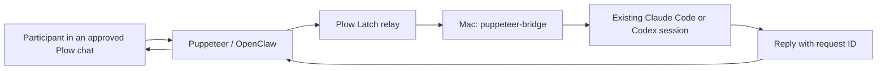

# Puppeteer

Let people in a Plow conversation talk to the Claude Code and Codex agents
running in MyPlow on your Mac. The local agent keeps its session and project,
and its reply returns to the conversation that asked.

Puppeteer is an OpenClaw variant built on the public Plow base image. Plow Chat
carries the conversation; Plow Latch connects to the Mac; MyPlow's `mp send`
reaches the existing session. There is no custom relay or inbound Mac port.



## Install on the Mac

Keep your existing MyPlow installation and install the separate connector:

```sh
uv tool install 'git+https://github.com/EnzoTironi/puppeteer.git@feat/openclaw-agent'
```

If MyPlow is not installed, run `uv tool install mypeople` first. On macOS with
Homebrew, install its terminal dependencies, authenticate a coding backend,
and start a local team:

```sh
brew install tmux ttyd asciinema
codex login
mypeople up --backend codex --detach
mypeople status
```

For Claude Code, use `claude auth login` and `--backend claude` instead.
Confirm the target agent can answer locally. This bridge reaches sessions
managed by MyPlow; it does not attach to arbitrary Codex desktop tabs or
unmanaged Claude terminals. Install and sign in
to [Plow Latch](https://github.com/plow-pbc/latch) on the same Plow account
used for Puppeteer. Keep the Mac awake and Latch open during the demo.

Log in with `plow-agents login` on the Mac. Its account token stays at
`~/.config/plow/token`; it is never copied into the cloud image.

Use `mypeople status` to find the full local agent ID. Use Plow's conversation
UID for the owner DM or group you want to share. Keep the group untrusted:
Puppeteer exposes only three narrow bridge tools to participants. The owner
also gets only those three tools in a group. Latch still approves the fixed
bridge operations. For an audience demo, share a dedicated coding session.
Run this in the owner's Mac terminal, replacing the sample IDs:

```sh
puppeteer-bridge configure \
  --agent coder=sams-mac/main:eng-codex \
  --chat cht_YOUR_CONVERSATION
puppeteer-bridge agents --chat cht_YOUR_CONVERSATION
```

Repeat `--agent alias=full-id` and `--chat UID` to share more. All listed
conversations can ask all listed agents. Running `configure` replaces the
complete grant list. Removing a conversation or alias also revokes access
to its stored replies. To turn off sharing, remove `~/.config/puppeteer/bridge.json`. This does not stop the coding agents.

The CLI uses MyPlow's `MYPEOPLE_CONFIG_PATH` / `MYPEOPLE_HOME` configuration.
`PUPPETEER_CONFIG` overrides the bridge configuration path.
`--token-file` overrides the local Plow account-token path. Custom homes
need matching owner-configured `PUPPETEER_MAC_READ_PATHS` and
`PUPPETEER_MAC_WRITE_PATHS` JSON arrays in the cloud deployment environment.
These paths cannot be supplied by a guest. Include the selected native runtime
directory in the write paths because `mp send` updates its queues as well as
the bridge ledger.
The owner-selected MyPlow configuration path is saved when running `configure`,
so later Latch commands and reply callbacks use that same local team.

## Audience demo with Sam's Mac

Sam runs **one Puppeteer deployment on his Plow account**, with his Mac's
Latch signed into that same account. He adds its phone number and the audience
to one iMessage group, then grants that group UID with the command above.
Audience members only join the group; they do not install another agent.
Deploying a separate copy under another account connects to that account's
Mac, not automatically to Sam's.

Only human messages that begin with the exact `/prompt` command are processed:

```text
/prompt List the shared coding agents
/prompt Fix the failing test in the demo project
/prompt coder: Explain what this project does
```

Normal conversation, `/promptfoo`, and `/prompt` appearing inside a sentence
are ignored before the model and are not forwarded to MyPlow. `/prompt` alone
gets a usage example and never starts local work. The command is case sensitive
and must be at the start of the message. Its prefix is removed before the
verified task reaches the local coding session. Use `/prompt status RECEIPT`
to resume an interrupted request in that same group.

The runtime binds each tool to its actual current chat and inbound message.
Guests cannot supply replacement text, another chat/message ID, paths, shell
commands, or Latch output handles. Pending approvals and running commands
use private, conversation-bound receipts. The Mac also enforces the prefix,
chat grant, agent grant, source identity, age, and request deduplication.

## Run the cloud agent locally

Clone the agent branch, then run it with Docker and `plow-agents` installed:

```sh
git clone --branch feat/openclaw-agent https://github.com/EnzoTironi/puppeteer.git
cd puppeteer
```

```sh
plow-agents login
plow-agents lines
plow-agents deploy --local --line ln_p1
```

Choose a free line. Deploy mints `plow-credentials` and starts Compose.
Add these three lines to that ignored file, then recreate the agent:

```dotenv
AGENT_ID=puppeteer
AGENT_NAME=Puppeteer
AGENT_BLURB=Talk to the Claude Code and Codex agents already running on your Mac.
```

```sh
docker compose up -d --force-recreate
docker compose logs -f
```

Text the selected number with `/prompt List the shared coding agents`. Ask one to
explain its project or make a small change, for example `/prompt Fix the failing test in the demo project`. Approve the
bridge command in Latch when it asks. Confirm the reply arrives in that same
conversation and the existing local session handled the task.

The base registers `AGENT_ID` and reports OpenClaw usage every five minutes.
This reports the cloud OpenClaw install's usage. Only the deployed OpenClaw agent's usage belongs to this install. The connector
does not attribute unrelated local coding usage to Puppeteer.

## Publish

Build and push a public image from this directory:

```sh
plow-agents image build ghcr.io/YOU/puppeteer-openclaw:v1
plow-agents image push ghcr.io/YOU/puppeteer-openclaw:v1
plow-agents profile --show
```

Make the GHCR package public. Give the Plow admin your account UID, the slug
`puppeteer`, and the exact digest reference printed by the push. The admin
enables 1-click deploy once. Later updates use:

```sh
plow-agents image push ghcr.io/YOU/puppeteer-openclaw:v2 --promote puppeteer
```

Register demo media with the Agent Index client. `--video` currently takes a
YouTube video ID; `--image` takes a public HTTPS screenshot URL. Until
1-click deploy is enabled, include a public install URL pointing at this
README. GitHub PR attachments are review evidence and do not by
themselves register the Agent Index media.

```sh
python3 agent_index_client.py --register --agent puppeteer \
  --name Puppeteer \
  --blurb 'Talk to the Claude Code and Codex agents already running on your Mac.' \
  --runtime OpenClaw --repo https://github.com/YOU/puppeteer \
  --video YOUR_YOUTUBE_ID --image https://YOUR_PUBLIC_SCREENSHOT \
  --install-url https://github.com/YOU/puppeteer/tree/YOUR_COMMIT
```

Post the repo URL, commit hash, and Agent Index ID to the hackathon
verification thread. The Plow team removes WIP after checking the MIT
license, usage, demo video, screenshot, and installation path. Building an
image or registering a listing alone does not complete that verification.

## Behavior

The local bridge accepts configured agent aliases and conversations.
It fetches the original inbound text from Plow using the Mac's own token,
checks the conversation, timestamp and `/prompt` prefix, then passes the command's remaining text to `mp send` on stdin.
It never interprets the participant's text as a shell command.

Each source message gets one persistent request ID. Concurrent retries do
not send twice. The local coding agent receives a callback command that
stores its answer under that ID. A private key delivered only to that
session authorizes its reply; only the key's hash is stored in the ledger.
The callback passes its configuration explicitly because Codex filters inherited
shell variables. Results can be read through the shared conversation. A submission receipt is not a completed answer. Uncertain
delivery remains uncertain instead of being automatically replayed.
Requests time out after 15 minutes. The cloud agent waits on the receipt;
if its turn is interrupted, a later status question resumes the receipt.

The grant list controls this bridge. Latch still controls which Mac
operations the cloud agent may execute; its policy and approvals remain
necessary. A human who separately approves broader shell access can also
authorize operations outside this bridge. The shared local agent retains
its existing project access, so choose an appropriate agent and project.

## Architecture

The connector is a standalone Python package with no MyPlow package dependency.
It reads the native MyPlow `queue.env`, roster and status files, and calls the
installed runtime's `bin/mp`. It does not patch MyPlow or use its private Python API.
The cloud image inherits Plow's OpenClaw boot and Agent Index reporter. It
adds three ordinary tools to the pinned Plow plugin, filters group ingress,
disables command coalescing, and forwards MCP's tool-name header. The build
fails if any expected pinned-source anchor changes.

## Verify

From the repository root:

```sh
python3 -m unittest discover -s tests -v
npm ci --ignore-scripts
npm test
npm run typecheck
```

These tests exercise HTTP source verification, concurrent duplicate
delivery, restart persistence, revocation, response correlation, and
failures. They do not prove a live Plow/Latch account or phone is connected.

## License

Puppeteer's code and persona are MIT licensed under this repository's
LICENSE. The base image retains its third-party licenses, including the
Apache-2.0 Plow base and plugin. The image contains no credentials. The prompt retains the base Plow authority
and messaging rules. See [THIRD_PARTY.md](THIRD_PARTY.md) for source attribution.
