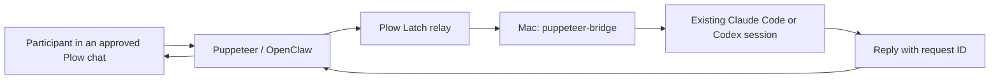

# Puppeteer

The agent introduces itself as Puppeteer in English. Plow's phone-line display
name, such as Alder, Oak or Spruce, does not change the agent's identity.

Let people in a Plow conversation talk to the Claude Code and Codex agents
running in MyPlow on your Mac. Use an existing session for one task at a time,
or let a MyPlow Boss supervise separate workers for a live group. Guided setup
reuses your existing Boss or creates one when needed. Each
reply returns to the participant and conversation that asked.

Puppeteer is an OpenClaw variant built on the public Plow base image. Plow Chat
carries the conversation; Plow Latch connects to the Mac; MyPlow's `mp send`
reaches the existing session. There is no custom relay or inbound Mac port.



## Connect an existing MyPlow Mac without a terminal

Deploy Puppeteer on the **same Plow account** as your Mac's Latch. The Agent
Index's 1-click deployment is enabled for Puppeteer. Select the public listing
and deploy it on a free line belonging to that account.

Keep your existing MyPlow installation and running coding sessions. Keep
Latch open and the Mac awake. Text Puppeteer privately:

```text
Set up Puppeteer on my Mac.
```

Puppeteer installs its pinned MIT connector through Latch and checks your Mac.
It offers to create an iMessage group and use your existing MyPlow Boss. If it
finds no Boss, it creates one for the group. Give it the first participant's
iMessage phone number or email. It creates the group, prepares a fresh coding
workspace with a Git commit and a passing test, and connects four parallel
workers. You can add more people in iMessage.

For example, when an existing Boss is found:

> I found your MyPlow Boss. I can create an iMessage group and a fresh coding
> workspace for it. Who should I add first? Send their phone number or iMessage email.

You do not need to copy technical IDs, prepare a demo repo or choose a worker
count. If you want an existing group or project, tell Puppeteer its name instead.
The owner-only demo operation prepares fixed local resources; the subsequent
share operation grants alias `coder` to your private DM and at most one chosen
group. Sharing again replaces those grants. Pending approvals resume their
original receipts, and setup retries preserve the workspace and native sessions.

**No Mac terminal commands or additional `plow-agents login` are needed for
this guided path.** MyPlow supplies `uv` and the local runtime. The connector
reads native MyPlow configuration and calls its installed `mp send`. It reaches
sessions managed by MyPlow, including Claude Code and Codex; it does not attach
to arbitrary Codex desktop tabs or unmanaged terminals.

Setup is restricted to the authenticated owner's main private DM. In every
phone group, including trusted groups and the owner's turns, only the three
narrow coding tools are available. The owner chooses the session and group;
the model cannot supply commands, paths, credentials, or replacement prompts.
The default audience setup creates a fresh coding project.

If MyPlow is missing, install and authenticate it before this flow using its
[upstream instructions](https://github.com/delattre1/mypeople). If Latch refuses
an operation, Puppeteer reports the refusal; it does not bypass it.

To stop group access without a terminal, ask Puppeteer privately to share
only with your private DM. To revoke all connector access, remove
`~/.config/puppeteer/bridge.json` on the Mac. This does not stop running coding
sessions or erase their worktrees. Custom MyPlow homes can use owner-configured
`PUPPETEER_MAC_READ_PATHS` and `PUPPETEER_MAC_WRITE_PATHS` JSON arrays in the
cloud environment, with the selected runtime directory included for writes.

## Advanced: manual connector setup

The original terminal path remains available for custom deployments:

```sh
uv tool install 'git+https://github.com/EnzoTironi/puppeteer.git@6c0cc5fbf04e43b84e290abbc39606ecac2b00c4'
plow-agents login
puppeteer-bridge configure \
  --agent coder=sams-mac/main:eng-codex \
  --chat cht_YOUR_CONVERSATION
```

Manual configuration uses the Mac's own `~/.config/plow/token` to fetch and
verify original Plow messages; it is not copied into the cloud. Pair through
the guided owner setup before using the cloud image's signed dispatch path.
`MYPEOPLE_CONFIG_PATH`, `MYPEOPLE_HOME`, `PUPPETEER_CONFIG`, `--token-file` and
`--api-base` support custom installations. Configure replaces the complete
agent and conversation grant list. Revoking a grant also revokes stored replies.

## Audience demo with Sam's Mac

Sam runs **one Puppeteer deployment on his Plow account**, with his Mac's
Latch signed into that same account. In Puppeteer's private setup conversation,
he asks it to create the audience group and supplies the first participant's
iMessage number or email. He can add more people in iMessage afterward, or
choose an existing group by name.
Audience members only join the group; they do not install another agent.
Deploying a separate copy under another account connects to that account's
Mac, not automatically to Sam's.

Only human messages that begin with the exact `/prompt` command are processed:

```text
/prompt help
/prompt agents
/prompt Fix the failing test in the demo project
/prompt status REQUEST_ID
/prompt coder: Explain what this project does
```

Normal conversation, `/promptfoo`, and `/prompt` appearing inside a sentence
are ignored before the model and are not forwarded to MyPlow. `/prompt` alone
gets a usage example and never starts local work. The command is case sensitive
and must be at the start of the message. Its prefix is removed before the
verified task reaches the local coding session. Use `/prompt status ID`
to resume an interrupted request in that same group. The eight-character ID
in the reply is sufficient; the full receipt remains valid. Use
`/prompt status ID full` to read a long reply in full.

The runtime binds each tool to its actual current chat and inbound message.
Guests cannot supply replacement text, another chat/message ID, paths, shell
commands, or Latch output handles. Pending approvals and running commands
use private, conversation-bound receipts. The Mac also enforces the prefix,
chat grant, agent grant, source identity, age, and request deduplication.

## Group responses and parallel workers

Puppeteer uses [Mac Guardian's warm, direct, practical personality](https://github.com/EnzoTironi/mac-guardian-agent/blob/f0b722431ea5a31fc4c14db7d1f8a8bf1c79c9cc/prompt/AGENTS.md), adapted to a shared coding team. It answers the request first, takes the next authorized step and reports confirmed results briefly. The marionettist stays in the visual branding. The same voice guides owner onboarding, fixed group status messages and native worker answers. Style never changes access or execution rules.

Group replies use English plain text. Each coding result identifies the sender,
a short request ID and the answering agent. For example:

```text
Alex · #a1234567
coder replied:

Changed greeting.py. Ran python3 test_greeting.py: 1 test passed.
```

The delivery layer derives that text from the verified tool status and actual
local answer. It drops free-form model commentary and fabricated result text.
A submitted task is never described as completed. Only the actual Latch
`awaiting_approval` state asks the Mac owner to approve.

For an audience, ask Puppeteer privately to create a group for your demo.
The guided flow uses the existing Boss or creates one, prepares a new Git project
and connects four workers automatically. Audience members join that group.

If you explicitly want your existing project, name it in the private setup chat.
Puppeteer uses inspected native IDs internally. The owner-only `share` tool
accepts a Boss target, a Claude Code or Codex project session at a Git root with
at least one commit, a worker count from one to eight and an optional group.
Four workers is the default. This advanced path remains available without
turning the default onboarding into a configuration questionnaire.

Puppeteer verifies the original message, records it in a private SQLite queue,
and starts separate native workers with `mp spawn --boss SELECTED_BOSS`.
Each request gets a fresh detached Git worktree. A participant's first task
starts from the selected project, including its tracked changes and untracked,
non-ignored files. Their follow-up starts from their own last completed worktree
and receives their previous task and actual reply as context. Other participants
start independently. The worker
uses the project's native Claude Code or Codex backend and returns the answer
with its private per-request callback. The connector performs the routing;
the Boss is the native parent and receives MyPlow lifecycle notifications.
Puppeteer does not wait for the Boss model to relay every message.

Up to the chosen number of workers run concurrently. One participant has one
active task per conversation; their later tasks wait while other people can
work. Up to 256 waiting tasks are accepted. Overflow receives an explicit
queue-full response and is not accepted. Queued work expires after 15 minutes.
Every result includes the original participant and eight-character request ID,
so out-of-order replies still match the correct request.

The phone group uses a fixed command router before the cloud model. The
router sends a receipt, watches only that receipt, and posts the verified
native answer automatically. It recovers pending receipt reads after gateway
restart without sending another task. An uncertain phone delivery is never
automatically repeated; `/prompt status ID` can retrieve its actual result.
The Mac rechecks the current chat, Boss and project grants before disclosing
results. Re-share only with the owner's private DM to revoke group access.

Workers edit their own worktrees. They do not automatically merge, push or
publish changes into the original project. Completed workers are retired
through MyPlow; their worktrees remain available for the owner to review.
The native agent still has its usual permissions: a worktree prevents routine
edit collisions and is not a filesystem sandbox.

Single-session mode remains available when `project` is omitted. One task
reserves that existing target. Concurrent tasks receive an accurate busy
response; they are not queued. Uncertain or timed-out session requests retain
the reservation. Parallel workers with uncertain delivery retain their slot;
the connector does not replace them while execution may still be running.
The owner can privately say "Stop the parallel demo." The owner-only stop tool
pauses new requests, cancels queued work and retires only that demo's workers.
It reports any stop it could not confirm. Worktrees stay available for review.
Sharing again explicitly resumes the demo. Native trust or login screens
produce a not-ready response; Puppeteer never pastes a task into those screens.

The channel keeps 4,096 handled IDs in its persistent checkpoint. Ordinary
chat is ignored before any model or Mac operation. Help, agent lists and
status checks never start a coding task. These are application limits,
not claims about Apple's group-size limits or production throughput.

For the stage, use an iMessage group whose members and bot are confirmed to
send and receive in that same group. Apple distinguishes group iMessage from
SMS: SMS responses can become individual messages instead of visible group
replies. Check the actual participants, devices and transport before inviting
the audience. [Apple's group-message guidance](https://support.apple.com/en-us/118236)
explains the difference. A 100-participant simulated Plow group test does not
prove that 100 physical iMessage participants are supported.

## Run the cloud agent locally

Clone the agent branch, then run it with Docker and `plow-agents` installed:

```sh
git clone --branch feat/openclaw-agent https://github.com/EnzoTironi/puppeteer.git
cd puppeteer
```

```sh
plow-agents login
plow-agents lines
plow-agents deploy --local --line ln_p1
```

Choose a free line. Deploy mints `plow-credentials` and starts Compose.
Add these three lines to that ignored file, then recreate the agent:

```dotenv
AGENT_ID=puppeteer
AGENT_NAME=Puppeteer
AGENT_BLURB=Talk to the Claude Code and Codex agents already running on your Mac.
```

```sh
docker compose up -d --force-recreate
docker compose logs -f
```

Text the selected number with `/prompt List the shared coding agents`. Ask one to
explain its project or make a small change, for example `/prompt Fix the failing test in the demo project`. Approve the
bridge command in Latch when it asks. Confirm the reply arrives in that same
conversation and the existing local session handled the task.

The base registers `AGENT_ID` and reports OpenClaw usage every five minutes.
This reports the cloud OpenClaw install's usage. Only the deployed OpenClaw agent's usage belongs to this install. The connector
does not attribute unrelated local coding usage to Puppeteer.

## Publish

Build and push a public image from this directory:

```sh
plow-agents image build ghcr.io/YOU/puppeteer-openclaw:v1
plow-agents image push ghcr.io/YOU/puppeteer-openclaw:v1
plow-agents profile --show
```

Make the GHCR package public. Give the Plow admin your account UID, the slug
`puppeteer`, and the exact digest reference printed by the push. The admin
enables 1-click deploy once. Later updates use:

```sh
plow-agents image push ghcr.io/YOU/puppeteer-openclaw:v2 --promote puppeteer
```

Register demo media with the Agent Index client. `--video` currently takes a
YouTube video ID; `--image` takes a public HTTPS screenshot URL. Until
1-click deploy is enabled, include a public install URL pointing at this
README. GitHub PR attachments are review evidence and do not by
themselves register the Agent Index media.

```sh
python3 agent_index_client.py --register --agent puppeteer \
  --name Puppeteer \
  --blurb 'Talk to the Claude Code and Codex agents already running on your Mac.' \
  --runtime OpenClaw --repo https://github.com/YOU/puppeteer \
  --video YOUR_YOUTUBE_ID --image https://YOUR_PUBLIC_SCREENSHOT \
  --install-url https://github.com/YOU/puppeteer/tree/YOUR_COMMIT
```

Post the repo URL, commit hash, and Agent Index ID to the hackathon
verification thread. The Plow team removes WIP after checking the MIT
license, usage, demo video, screenshot, and installation path. Building an
image or registering a listing alone does not complete that verification.

## Behavior

The local bridge accepts configured agent aliases and conversations.
The cloud tool fetches the original inbound text using its own deployment
credential, checks the actual sender and conversation, and signs a proof with
a per-install pairing key. The paired Mac verifies the signature, source UID,
conversation, timestamp and `/prompt` prefix, then passes the remaining text
to `mp send` on stdin. Account credentials never leave their original host;
the source key stays in private files and is absent from tool results and
request ledgers. The manual CLI path can instead verify with a local Plow token.
It never interprets the participant's text as a shell command.

Each source message gets one persistent request ID. Concurrent retries do
not send twice. The local coding agent receives a callback command that
stores its answer under that ID. A private key delivered only to that
session authorizes its reply; only the key's hash is stored in the ledger.
The callback passes its configuration explicitly because Codex filters inherited
shell variables. Results can be read through the shared conversation. A submission receipt is not a completed answer. Uncertain
delivery remains uncertain instead of being automatically replayed.
Requests time out after 15 minutes. The cloud agent waits on the receipt;
if its turn is interrupted, a later status question resumes the receipt.

The grant list controls this bridge. Latch still controls which Mac
operations the cloud agent may execute; its policy and approvals remain
necessary. A human who separately approves broader shell access can also
authorize operations outside this bridge. The shared local agent retains
its existing project access, so choose an appropriate agent and project.

## Architecture

The connector is a standalone Python package with no MyPlow package dependency.
It reads the native MyPlow `queue.env`, roster and status files, and calls the
installed runtime's `bin/mp`. It does not patch MyPlow or use its private Python API.
The cloud image inherits Plow's OpenClaw boot and Agent Index reporter. It
adds three audience tools and one owner-only setup tool to the pinned Plow plugin, filters group ingress,
disables command coalescing, and forwards MCP's tool-name header. The build
fails if any expected pinned-source anchor changes.

## Verify

From the repository root:

```sh
python3 -m unittest discover -s tests -v
npm ci --ignore-scripts
npm test
npm run typecheck
```

These tests exercise HTTP source verification, concurrent duplicate
delivery, restart persistence, revocation, response correlation, and
failures. They do not prove a live Plow/Latch account or phone is connected.

## License

Puppeteer's code and persona are MIT licensed under this repository's
LICENSE. The base image retains its third-party licenses, including the
Apache-2.0 Plow base and plugin. The image contains no credentials. The prompt retains the base Plow authority
and messaging rules. See [THIRD_PARTY.md](THIRD_PARTY.md) for source attribution.
